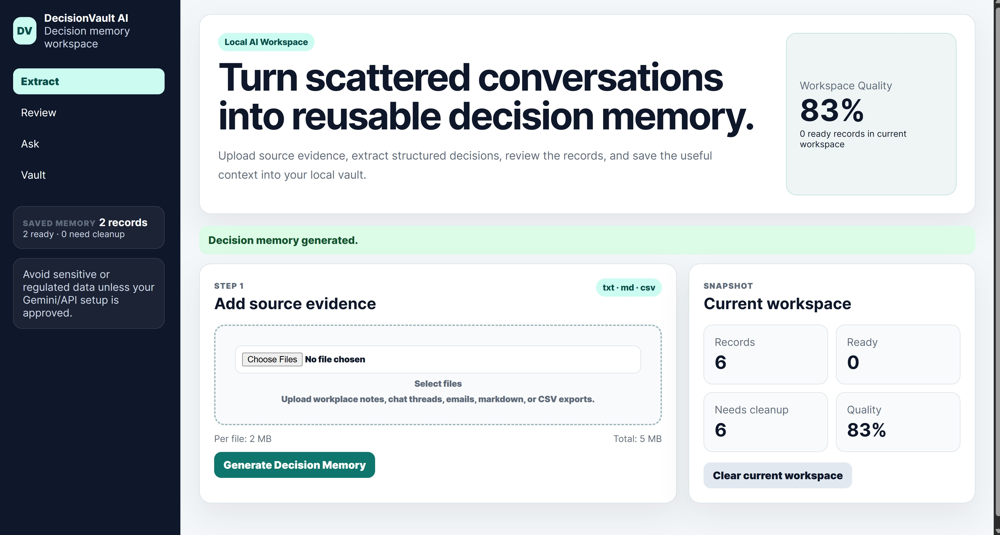
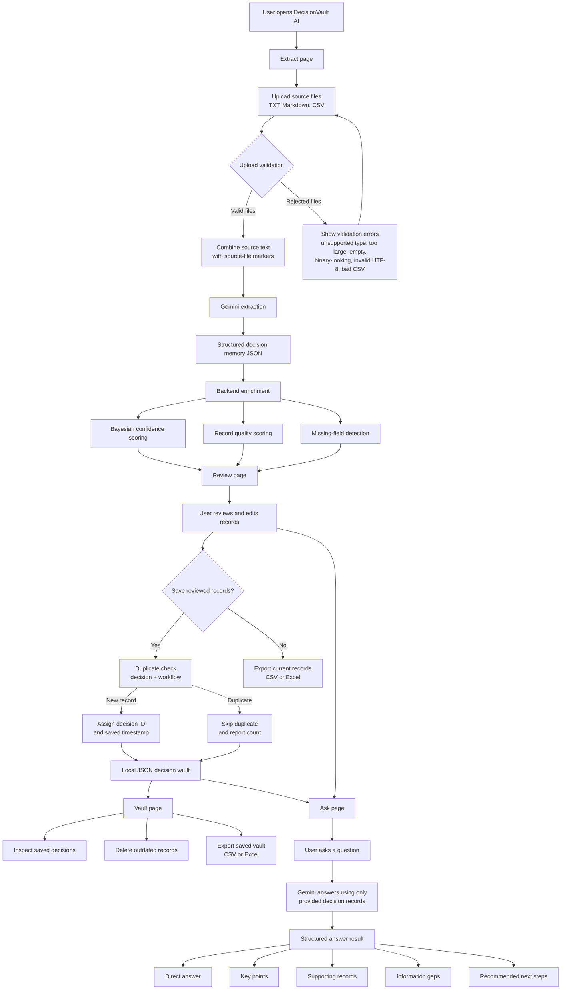
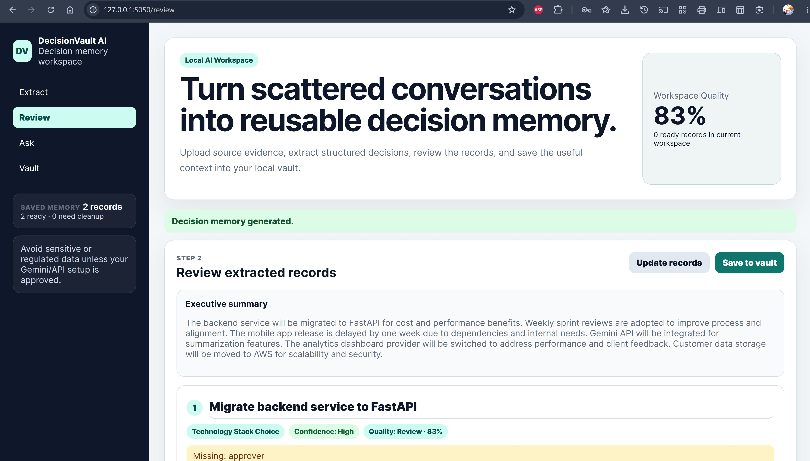
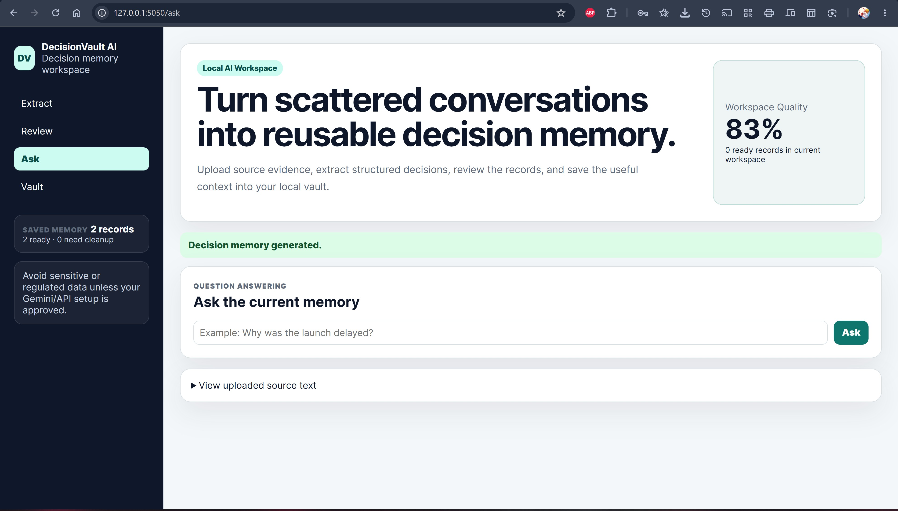
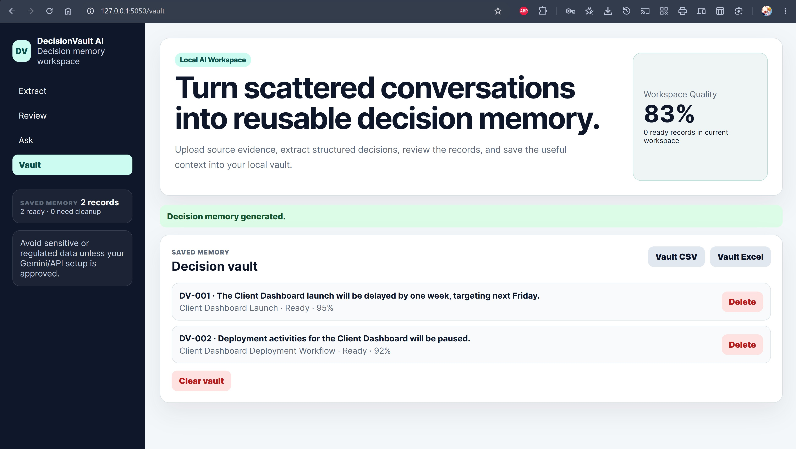

# DecisionVault AI

DecisionVault AI is a GenAI-powered decision memory workspace for turning messy workplace communication into structured, reviewable decision records.

It helps teams capture what was decided, why it was decided, who owns the next step, who approved it, which workflow is affected, and what evidence supports the decision.



## What’s new in the current build

The project has evolved from a simple prototype into a more complete decision-intelligence workflow with:

- a custom Flask + HTML/CSS experience instead of a Streamlit-only interface
- a dedicated review workflow so extracted records can be edited before saving
- a structured Ask experience that answers questions using the current or saved decision memory
- stronger upload validation for file type, size, encoding, and CSV usability
- local JSON vault storage with duplicate prevention and export options
- a desktop wrapper for Windows users via pywebview and launch scripts

## Product focus

```text
messy workplace communication -> reviewed decision records -> searchable decision vault
```

DecisionVault AI is designed to preserve durable business context from meetings, Slack-style threads, emails, incident notes, project updates, and CSV/text exports.

## Main experience

The app now offers four primary views:

- Extract: upload source files and generate structured decision memory
- Review: inspect and edit the extracted records before saving
- Ask: ask professional, structured questions over the current decision context
- Vault: manage saved decision records locally

## Workflow diagram



## Workflow

1. Upload evidence from .txt, .md, or .csv files.
2. Validate the uploads before sending anything to Gemini.
3. Extract structured decision records with rationale, owner, approver, workflow, dependencies, evidence, and confidence.
4. Enrich the records with quality signals, missing-field warnings, and Bayesian confidence scoring.
5. Review and edit the results before saving them.
6. Save reviewed records to a local decision vault with duplicate checks.
7. Ask questions over the current or saved memory and receive structured answers with supporting records, gaps, and next steps.
8. Export current records or vault contents as CSV or Excel when needed.

## What the app does well

- Extracts structured business decisions from meeting notes, threads, emails, and project communications
- Captures rationale, ownership, approvals, affected workflow, dependencies, evidence, and reusable context
- Scores records for completeness and review readiness
- Lets users review and edit AI output before it becomes permanent memory
- Saves reviewed records into a local decision vault
- Provides structured Ask results with direct answers, key points, supporting records, information gaps, and next steps
- Prevents simple duplicate saves
- Exports data for sharing or downstream analysis

## Screenshots

### Extract workspace


### Review workspace



### Ask workspace



### Vault workspace



## Tech stack

- Python
- Flask
- Custom HTML/CSS frontend
- Gemini 2.5 Flash via google-genai
- pywebview for desktop wrapping
- python-dotenv
- pandas
- openpyxl
- Local JSON storage
- Streamlit legacy UI retained in app.py for compatibility

## Quick start

Create and activate a virtual environment:

```powershell
python -m venv .venv
.\.venv\Scripts\Activate.ps1
```

Install dependencies:

```powershell
python -m pip install -r requirements.txt
```

Create a .env file in the project folder:

```text
GEMINI_API_KEY=your_api_key_here
```

Optional configuration values:

```text
DECISION_VAULT_FILE=decision_vault.json
MAX_UPLOAD_FILE_SIZE_MB=2
MAX_TOTAL_UPLOAD_SIZE_MB=5
```

## Run the web app

Start the custom Flask app:

```powershell
python flask_app.py
```

Then open:

```text
http://127.0.0.1:5050
```

## Run the desktop app

Start the desktop experience:

```powershell
python desktop_flask_app.py
```

On Windows, you can also launch it with:

```text
launch_decisionvault_custom.bat
```

## Optional legacy Streamlit app

The earlier Streamlit version is still available:

```powershell
python -m streamlit run app.py
```

Desktop wrapper for the Streamlit version:

```powershell
python desktop_app.py
```

## Example files

For a quick example workflow, upload these files together:

- meeting_notes.txt
- slack_thread.txt
- email_thread.txt

For a more realistic workplace-style example, use files from sample_data/:

- sample_data/real_meeting_notes_anonymized.txt
- sample_data/real_slack_thread_anonymized.txt
- sample_data/real_email_thread_anonymized.txt
- sample_data/incident_decisions_anonymized.csv

## Upload safety

DecisionVault AI validates uploads before sending text to Gemini:

- accepts only .txt, .md, and .csv files
- enforces per-file and combined upload size limits
- rejects empty files
- rejects binary-looking files
- requires UTF-8 readable text
- validates that CSV files contain usable rows

This version does not include antivirus or malware scanning. A public or enterprise deployment should add a file-scanning service such as ClamAV or a cloud-based security layer before processing uploads.

## Local Storage

Saved decisions are stored in:

```text
decision_vault.json
```

You can override this path with `DECISION_VAULT_FILE` in `.env`.

This keeps the project simple and easy to inspect. A production or team version should move storage to SQLite, Postgres, or another managed database.

## Project Structure

```text
flask_app.py                      Custom Flask app entrypoint
decisionvault/flask_app_core.py   Main Flask routes and app workflow
templates/index.html              Custom app UI
static/styles.css                 Custom app styling
desktop_flask_app.py              Desktop wrapper for the custom app
launch_decisionvault_custom.bat   Windows launcher for the custom app
app.py                            Legacy Streamlit entrypoint
decisionvault/streamlit_app.py    Legacy Streamlit implementation
desktop_app.py                    Desktop wrapper for the Streamlit app
decisionvault/                    Reusable validation, storage, confidence, extraction, and UI view-model helpers
tests/                            Unit tests for core non-UI behavior
sample_data/                      Anonymized example inputs
assets/                           README screenshots
```

## Run Tests

```powershell
python -m unittest discover -s tests
```

## Current Scope

Current capabilities:

- upload `.txt`, `.md`, and `.csv` files
- extract decision records with Gemini
- review and edit extracted records before export or save
- score record completeness with backend quality signals
- save records locally in `decision_vault.json`
- ask structured questions over current decision memory
- manage saved vault records
- prevent simple duplicate saves
- export CSV and Excel files

Not production-ready yet:

- no authentication or team workspaces
- no production database
- no enterprise access controls
- no live Slack, Jira, Gmail, or document integrations
- no formal compliance or data retention controls

## Privacy Note

Avoid uploading confidential, regulated, or sensitive workplace data unless your Gemini/API setup is approved for that use. See [PRIVACY.md](PRIVACY.md) for an anonymization checklist and data safety notes.
