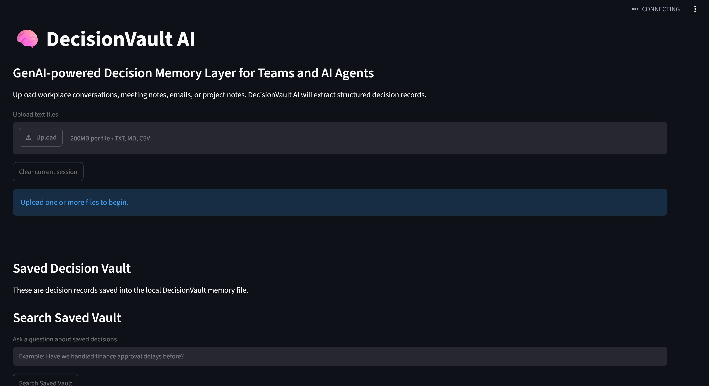
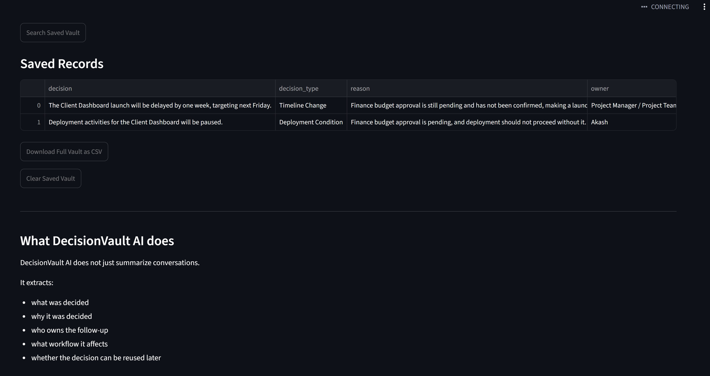

# DecisionVault AI

DecisionVault AI is a GenAI-powered decision memory layer for teams and AI agents. It turns messy workplace communication into structured, reusable decision records.

Instead of only summarizing meetings, DecisionVault AI extracts what was decided, why it was decided, who owns the next step, who approved it, what workflow it affects, and what evidence supports it.



## Product Positioning

DecisionVault AI is designed as an out-of-the-box decision memory MVP:

```text
messy workplace communication -> structured decision records -> searchable decision vault
```

It is not just a meeting summarizer. The product focuses on durable business context that teams and AI agents can reuse later.

## Why This Matters Now

Modern teams make decisions across meetings, Slack-style threads, email, project notes, incident reviews, and planning documents. The decision itself often gets buried, while the reasoning, owner, approver, and dependencies become difficult to recover later.

DecisionVault AI addresses that gap by turning unstructured communication into reusable decision records with source evidence and confidence levels.

## What It Does

- Extracts structured business decisions from meeting notes, Slack-style threads, emails, project notes, and CSV/text exports
- Captures decision rationale, owner, approver, affected workflow, dependencies, source evidence, confidence, and reusable context
- Saves extracted records into a local decision vault
- Lets users ask questions across current extraction results or saved decision history
- Prevents simple duplicate saves
- Exports current and saved records as CSV or Excel
- Flags ambiguous items for human review

## What Makes The GenAI Focus Different

DecisionVault AI uses GenAI to interpret messy human communication and identify decisions that are not always written in a clean format. The focus is on extracting:

- the actual business choice
- the reason behind it
- owner and approver context
- dependencies and conditions
- source evidence
- confidence level
- reusable context for future teams or AI agents

This makes the app more decision-memory oriented than a generic summarizer.

## Saved Decision Vault

The saved vault turns one-off extraction into reusable organizational memory. Users can search previous decisions, filter records by keyword, confidence, or project/workflow, and download filtered or full vault exports.



## Tech Stack

- Python
- Streamlit
- Gemini 2.5 Flash through `google-genai`
- `python-dotenv`
- pandas
- openpyxl
- Local JSON storage

## Setup

Create and activate a virtual environment:

```powershell
python -m venv .venv
.\.venv\Scripts\Activate.ps1
```

Install dependencies:

```powershell
python -m pip install -r requirements.txt
```

Create a `.env` file in the project folder:

```text
GEMINI_API_KEY=your_api_key_here
```

For Streamlit deployment, you can also set `GEMINI_API_KEY` in Streamlit secrets.
The local vault file can be changed with:

```text
DECISION_VAULT_FILE=data/decision_vault.json
```

## Run Locally

```powershell
python -m streamlit run app.py
```

## Demo Files

For a quick demo, upload these files together:

- `meeting_notes.txt`
- `slack_thread.txt`
- `email_thread.txt`

Then click **Generate Decision Memory**.

For a more realistic workplace-style demo, upload files from `sample_data/`:

- `sample_data/real_meeting_notes_anonymized.txt`
- `sample_data/real_slack_thread_anonymized.txt`
- `sample_data/real_email_thread_anonymized.txt`
- `sample_data/incident_decisions_anonymized.csv`

These files are anonymized examples that mimic real decision-heavy workplace communication.

## Upload Safety

DecisionVault AI validates uploads before sending text to Gemini:

- accepts only `.txt`, `.md`, and `.csv`
- enforces per-file and combined upload size limits
- rejects empty files
- rejects binary-looking files
- requires UTF-8 readable text
- validates that `.csv` files contain usable CSV rows

This MVP does not include antivirus or malware scanning. A public or enterprise
deployment should add an antivirus service such as ClamAV or a cloud file
scanning service before processing uploaded files.

## Local Storage

Saved decisions are stored in:

```text
decision_vault.json
```

You can override this path with `DECISION_VAULT_FILE` in `.env` or Streamlit
secrets.

This keeps the MVP simple and easy to inspect. A production or team version should move this storage to SQLite, Postgres, or another managed database.

## Deployment

The fastest deployment path is Streamlit Community Cloud:

1. Connect this GitHub repository.
2. Set `GEMINI_API_KEY` as a Streamlit secret.
3. Deploy `app.py`.

Render, Railway, Azure, or other Python-friendly hosts can also run the app with:

```powershell
python -m streamlit run app.py
```

## MVP Scope

This version intentionally avoids real Slack, Jira, Gmail, or document management integrations. The goal is to validate the decision-memory workflow first:

```text
messy workplace text -> structured decision records -> saved searchable vault
```

Current MVP capabilities:

- upload `.txt`, `.md`, and `.csv` files
- extract decision records with Gemini
- save records locally in `decision_vault.json`
- search current records and saved vault records
- prevent simple duplicate saves
- export CSV and Excel files
- review low-confidence or ambiguous items

Not production-ready yet:

- no authentication or team workspaces
- no production database
- no enterprise access controls
- no live Slack, Jira, Gmail, or document integrations
- no formal compliance or data retention controls

## Privacy Note

Avoid uploading confidential, regulated, or sensitive workplace data unless your Gemini/API setup is approved for that use. See [PRIVACY.md](PRIVACY.md) for an anonymization checklist and data safety notes.
